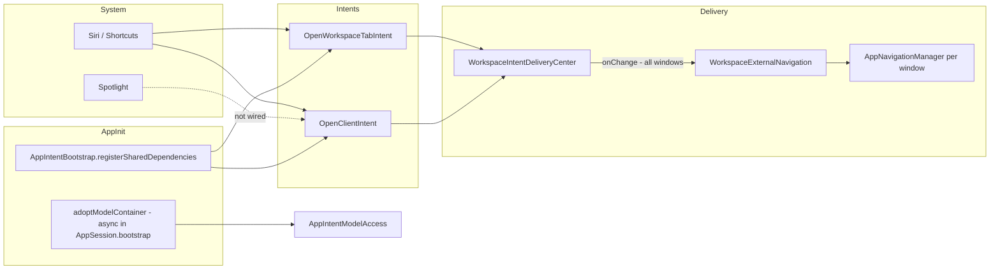

## App Intents Audit

**Scope:** `Packages/AppShell/Sources/AppShell/App/Intents/`, bootstrap/delivery wiring, `InvoicingAppShortcuts`, tests.  
**Skills:** [app-intents](file:///Users/user/.agents/skills/app-intents/SKILL.md), [macos-window-management](file:///Users/user/Developer/InvoicingApplication/InvoicingApplication/.cursor/skills/macos-window-management/SKILL.md) (intent → window routing).

---

### SkillCoverage: **~47%** (full skill) · **~64%** (applicable navigation MVP)

| Skill area | Score | Notes |
|---|---|---|
| Fundamentals | 90% | Two intents, `perform()`, dialog, `LocalizedStringResource` titles |
| Parameters | 85% | `@Parameter`, `WorkspaceTabAppEnum` |
| Entities | 60% | Shadow `ClientEntity`; no `@Property`, no `IndexedEntity` |
| Shortcuts & Siri | 70% | Provider + `\(.applicationName)`; missing non-parameterized phrases |
| Open / navigation | 45% | Works via delivery queue; not `OpenIntent` |
| Dependencies | 75% | `@Dependency` + bootstrap; async `ModelContainer` adopt |
| Spotlight | 0% | No indexing |
| Assistant schemas | 0% | None |
| Siri / Intelligence | 5% | Dialog only; no donations, `RelevantEntities` |
| On-screen awareness | 0% | No view annotations |
| Testing | 40% | Helper tests; no `perform()` or `AppIntentsTesting` |
| Anti-patterns | 85% | Avoids `@Model`/`AppEntity`, `@Query` in intents, missing `\(.applicationName)` |

---

### Strengths

1. **Shadow entity pattern** — `ClientEntity` is a `Sendable` struct; SwiftData stays behind `AppIntentModelAccess` with ephemeral `ModelContext` per fetch (`AppIntentModelAccess.swift:20–89`).

2. **Dependency bootstrap in `App.init()`** — Dependencies register before UI; works for headless Shortcuts invocations (`InvoicingApplicationApp.swift:12–16`, `AppIntentBootstrap.swift:7–10`).

3. **`AppShortcutsProvider` wired correctly** — Both intents registered; all phrases include `\(.applicationName)` (`InvoicingAppShortcuts.swift:3–24`).

4. **Entity query completeness** — `ClientEntityQuery` implements mandatory `entities(for:)`, string search, and `suggestedEntities()` (`ClientEntity.swift:24–39`).

5. **Navigation decoupling** — Intents enqueue; UI consumes via `WorkspaceExternalNavigation` → `AppNavigationManager` (`WorkspaceIntentDeliveryCenter.swift`, `WorkspaceExternalNavigation.swift`).

6. **Validation on open** — `OpenClientIntent` verifies client exists before enqueue (`OpenClientIntent.swift:23–25`).

7. **Tab enum mapping** — `WorkspaceTabAppEnum` cleanly maps to `AppTab` with display representations (`WorkspaceTabAppEnum.swift`).

---

### Findings

#### P0 — None identified
No compile-breaking or data-corruption issues found.

---

#### P1 — High impact / user-visible failures

| ID | Location | Rule | Why | Fix |
|---|---|---|---|---|
| P1-1 | `WorkspaceWindowRoot.swift:61–65` | OpenIntent navigation must survive cold launch (`open-and-snippet-intents.md`: setup in `App.init()`, nav state before UI) | `onChange(of: pendingNavigation)` guards on `sceneSession`; if intent fires during startup, guard fails and **pending is never replayed** when session becomes ready | After `sceneSession` is set (`.task` ~L50), call a `consumePendingIfNeeded()` that reads and applies any queued navigation |
| P1-2 | `AppSession.swift:66`, `AppIntentModelAccess.swift:36–42` | Dependencies: `ModelContainer` in `App.init()` (`dependencies.md`) | `adoptModelContainer` runs async in `bootstrap()`; Shortcuts during/just-after launch can hit `containerUnavailable` | Create/adopt container synchronously in `App.init()`, or have intents await readiness with retry/backoff before throwing |
| P1-3 | `WorkspaceWindowRoot.swift:61–64` + `ApplicationWorkspaceContext.swift:16–18` | macOS multi-window: route to active workspace (`macos-window-management`) | All workspace windows observe shared `WorkspaceIntentDeliveryCenter`; **every window** applies navigation to its own `navigationManager` | Gate delivery: `guard workspaceContext.isActive(sceneSession)` before apply, or route through `activeWorkspaceSceneSession` only |

---

#### P2 — Important gaps / non-idiomatic patterns

| ID | Location | Rule | Why | Fix |
|---|---|---|---|---|
| P2-1 | `OpenClientIntent.swift:4–28` | Prefer `OpenIntent` for “open this thing” (`open-and-snippet-intents.md`, skill decision tree) | Uses plain `AppIntent` + manual `openAppWhenRun`; misses system open semantics, `target` parameter convention, Spotlight tap routing | Refactor to `OpenClientIntent: OpenIntent` with `@Parameter var target: ClientEntity`; drop redundant `openAppWhenRun` |
| P2-2 | `InvoicingAppShortcuts.swift:7–20` | Non-parameterized phrase required (`shortcuts-and-siri.md`, core instructions L254) | **All phrases are parameterized** (`\(\.$tab)`, `\(\.$client)`); shortcuts invisible in Spotlight/Siri gallery until first run populates parameter cache | Add e.g. `"Open Invoices in \(.applicationName)"`, `"Open a client in \(.applicationName)"` (or one shortcut per common tab) |
| P2-3 | *(missing)* | `updateAppShortcutParameters()` on entity lifecycle changes (core instructions L246) | Client rename/delete never invalidates cached Siri/Shortcuts parameter candidates | Call `InvoicingAppShortcuts.updateAppShortcutParameters()` after client CRUD |
| P2-4 | `AppIntentTests.swift` | Test `perform()` directly (`testing-intents.md`) | Tests cover helpers only; no tests for `OpenWorkspaceTabIntent.perform()` / `OpenClientIntent.perform()` success or error paths | Add struct tests with mocked `@Dependency` registry |
| P2-5 | `AppIntentModelAccess.swift:75–79` | `EntityStringQuery` should scale (`entities.md`) | `searchClients` fetches **all** `Client` rows then filters in memory | Push filter into `#Predicate` or indexed fetch with `fetchLimit` |

---

#### P3 — Polish / future-proofing

| ID | Location | Rule | Why | Fix |
|---|---|---|---|---|
| P3-1 | `ClientEntity.swift:11–12` | `@Property` on exposed fields (`entities.md`) | `displayName` is plain stored property — invisible to Find/sort/filter in Shortcuts | `@Property var displayName: String` |
| P3-2 | `InvoicingAppShortcuts.swift:3` | `shortcutTileColor` (`shortcuts-and-siri.md`) | Missing tile branding in Shortcuts home | `static let shortcutTileColor: ShortcutTileColor = .blue` (or brand color) |
| P3-3 | `OpenWorkspaceTabIntent.swift:23`, `OpenClientIntent.swift:27` | Localized dialog (`fundamentals.md`) | Dialog interpolates raw `String` titles/names | Use `LocalizedStringResource` or catalog keys |
| P3-4 | *(missing)* | In-app discoverability (`shortcuts-and-siri.md`) | No `SiriTipView` / `ShortcutsLink` anywhere in app | Add to settings or relevant feature screens |
| P3-5 | `AppIntentTests.swift` | `AppIntentsTesting` integration (`testing-intents.md`) | No out-of-process intent/query/Spotlight tests | Add XCUITest bundle with `AppIntentsTesting` when targeting macOS 15+/iOS 27+ |
| P3-6 | `WorkspaceIntentDeliveryCenter.swift:8`, `AppIntentModelAccess.swift:22` | `@unchecked Sendable` | Relies on manual locking / `@MainActor` enqueue | Document invariants; consider `@MainActor` actor wrapper for delivery |

---

### PrioritizedFixes (Top 3)

1. **Fix intent delivery lifecycle** — Replay pending navigation when `sceneSession` becomes ready; route only to `ApplicationWorkspaceContext.activeWorkspaceSceneSession` (fixes P1-1, P1-3).

2. **Make `ModelContainer` intent-ready at launch** — Synchronous adopt in `App.init()` or intent-side readiness gate (fixes P1-2).

3. **Adopt `OpenIntent` + discovery phrases** — Refactor `OpenClientIntent`; add non-parameterized shortcut phrases; wire `updateAppShortcutParameters()` on client mutations (fixes P2-1, P2-2, P2-3).

---

### Gaps vs Full Product Surface

| Surface | Status | Gap |
|---|---|---|
| **Shortcuts (in-app actions)** | Partial | 2/10 `AppShortcut` slots; tabs + clients only |
| **Siri voice** | Partial | Parameterized phrases only; no flexible non-param discovery; no donations |
| **Spotlight** | Missing | No `IndexedEntity`, `indexAppEntities`, or `IndexedEntityQuery` for clients/invoices/sessions |
| **Find intents** | Partial | Client string query only; no `EntityPropertyQuery`, no invoice/session entities |
| **Apple Intelligence** | Missing | No `@AssistantEntity` / `@AssistantIntent`, no `ShowInAppSearchResultsIntent` |
| **On-screen Siri** | Missing | No `.userActivity` / `.appEntityIdentifier` on client/invoice views |
| **Deep links** | Missing | No `URLRepresentableEntity` / universal-link open path |
| **Widgets / Control Center** | Missing | No `WidgetConfigurationIntent` / `ControlConfigurationIntent` |
| **Proactive suggestions** | Missing | No `RelevantEntities`, no `IntentDonationManager` |
| **Domain coverage** | Narrow | No intents for invoices, sessions, billing hub actions, calendar, NDIS catalogue search |
| **Testing** | Shallow | No end-to-end Shortcuts/Siri path validation |

---

### Architecture Summary

**Bottom line:** Foundation is sound for macOS workspace navigation via Shortcuts. Critical gaps are **delivery timing** (cold start + multi-window), **async container readiness**, and **zero Spotlight/Siri Intelligence surface**. Fixing delivery + adopting `OpenIntent`/Spotlight indexing would move coverage from ~47% toward ~70% on the full skill checklist.

[REDACTED]